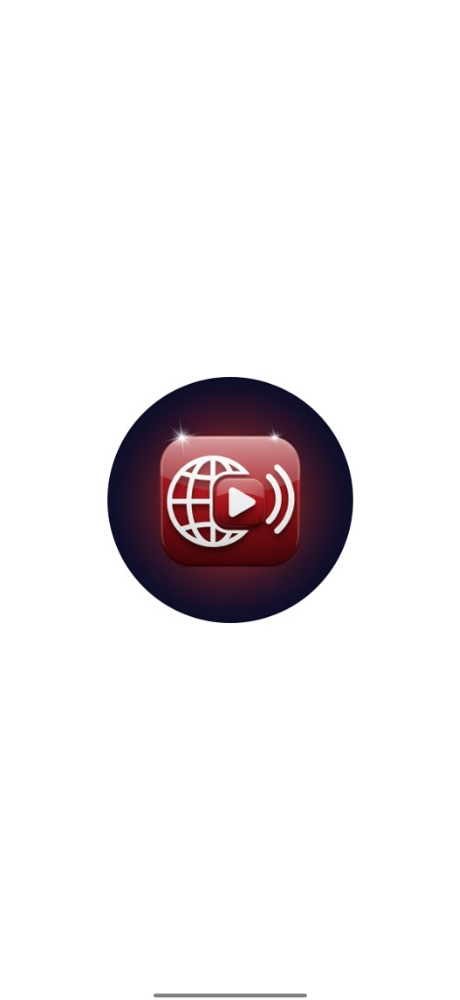
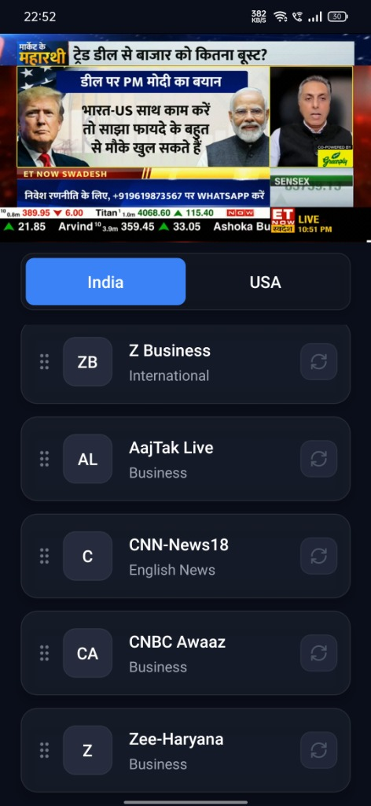
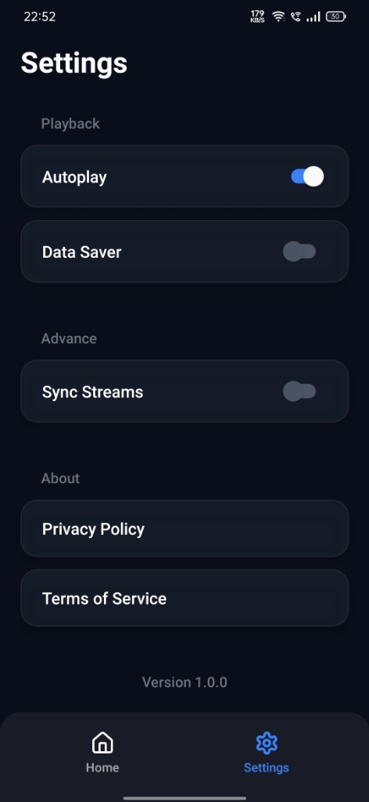

<p align="center">
  
</p>

<h1 align="center">LiveNews</h1>

<p align="center">
  
  
  
</p>

<p align="center">
  <a href="#features">Features</a> •
  <a href="#getting-started">Installation</a> •
  <a href="#building-for-production">Build Guide</a> •
  <a href="https://github.com/gitadityakumar/LiveNews/issues">Request Feature</a>
</p>

---

A modern, high-performance Live News streaming application built with React Native and Expo. This app allows users to watch live news streams with a premium user experience, featuring a draggable video player and real-time news updates.

## Features

- **Live Streaming**: Watch real-time news channels directly within the app.
- **Draggable Video Player**: A premium, interactive video player that can be minimized and moved around the screen.
- **Dynamic Channel List**: Browse through a curated list of news channels with smooth animations.
- **Tab Bar Animations**: Sleek tab bar transitions that respond to user interaction.
- **Tracing Border**: Visual feedback when streams are being captured or loaded.
- **Network Inspector**: Built-in tool for monitoring network activity and stream performance.

## Screenshots

<p align="center">
  
  
  
</p>

## Tech Stack

- **Framework**: [Expo](https://expo.dev/) / [React Native](https://reactnative.dev/)
- **Navigation**: Expo Router (File-based routing)
- **Animations**: React Native Reanimated
- **Gestures**: React Native Gesture Handler
- **Styling**: NativeWind / Tailwind CSS
- **Stream Handling**: Expo-video
## Getting Started

### Prerequisites

- Node.js (v18 or later)
- npm or yarn
- Expo Go app on your mobile device (for testing)

### Installation

1. Clone the repository:
   ```bash
   git clone https://github.com/gitadityakumar/LiveNews.git
   cd LiveNews
   ```

2. Install dependencies:
   ```bash
   npm install
   ```

3. Set up environment variables:
   Create a .env file in the root directory and add your configuration (e.g., API keys, stream URLs).

4. Start the development server:
   ```bash
   npx expo start
   ```

## Project Structure

- `app/`: Contains the main application routes and screens.
- `components/`: Reusable UI components (VideoPlayer, NewsCard, etc.).
- `constants/`: Global constants and theme configurations.
- `hooks/`: Custom React hooks for shared logic.
- `utils/`: Helper functions and storage utilities.
- `assets/`: Static assets like images and fonts.

## Building for Production

To build the application for production (e.g., generating an APK for Android), follow these steps:

### Android Build

1. **Prerequisites**: Ensure you have a Java Development Kit (JDK) installed and configured on your system.
2. **Generate Native Folders**: Run the prebuild command to generate the `android` and `ios` directories.
   ```bash
   npx expo prebuild
   ```
3. **Build the APK**: Navigate to the `android` directory and run the Gradle build command.
   ```bash
   cd android
   ./gradlew assembleRelease
   ```
4. **Locate the APK**: Once completed, the generated APK can be found at:
   `android/app/build/outputs/apk/release/app-release.apk`

### iOS Build

Building for iOS requires a macOS environment with Xcode installed. After running `npx expo prebuild`, you can open the `.xcworkspace` file in the `ios` directory and build through Xcode.

## License

This project is for educational purposes. All rights reserved to the respective news channel owners.


<p align="center">
  <b>Connect with the developer</b><br><br>
  <a href="https://github.com/gitadityakumar">
    
  </a>
</p>

---

<p align="center">
  Built with ❤️ by <a href="https://github.com/gitadityakumar">gitadityakumar</a>
</p>
